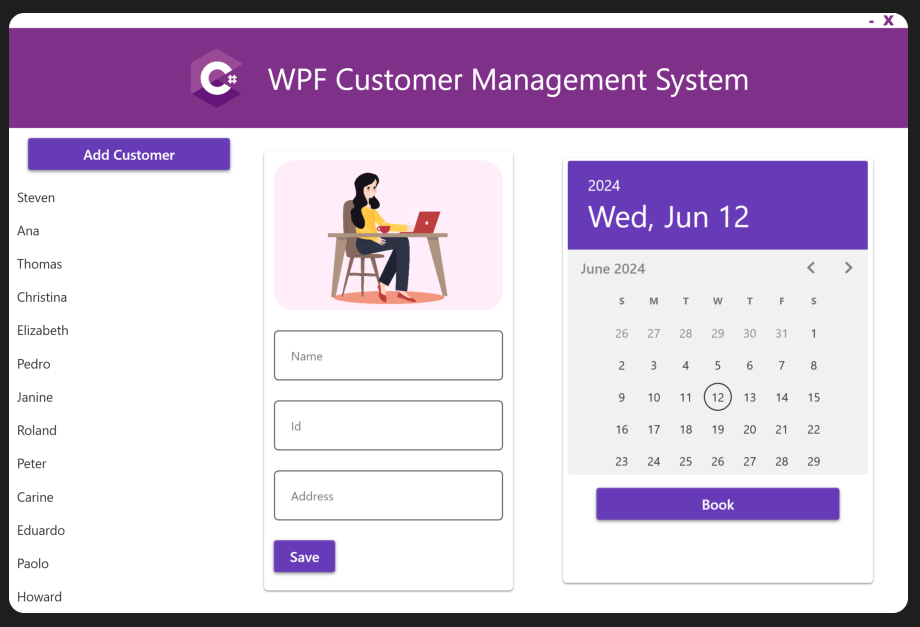

# WPF_CMS App

## Overview

What is WPF_CMS App?
- WPF_CMS App is a customer management system designed for administrators, utilizing a custom SQL Server database. It features data binding and an MVC design pattern to ensure maintainability. The app efficiently manages customer data and appointments using C#, WPF, SQL, LINQ, and Entity Framework.

### Features
Visuals of WPF_CMS app's screen:
